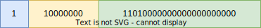

<style>
img[alt~="center"] {
  display: block;
  margin: 0 auto;
}
</style>

# Представление данных в компьютере

---

# Целые числа
* Регистры процессора хранят числа
* Но как именно эти числа представлены?
* Беззнаковые и знаковые типы

---
# Беззнаковые типы
* Представляют из себя $N$-битные положительные целые числа на отрезке $[0, 2^N - 1]$
* Переполнение точно определено стандартом C (как сложение в $\mathbb{Z}_{2^N}$)
* $1111 + 0001 = \textcolor{red}{1}0000 = 0$
* `unsigned`, `unsigned int`, `uint32_t`, etc...

---
# Endianess
* Если N = 64, то 64 / 8 = 8 байт нужно, чтобы представить число в памяти
* Если N = 32, то 32 / 8 = 4 байта
* В какой последовательности хранить биты?

---
# Endianess


---
# Выравнивание
* Адрес называется выровненным по границе $N$-байт, если он кратен $N$ (где N – степень двойки)
* Полезное свойство: $\log_2 N$ нулей на конце
* x86: числа быстрее считываются процессором, если они имеют выравнивание кратное их размеру
* ARM: невыровненный доступ запрещён
* Чтение по выровненным адресам *атомарно*

---

```c
int main() {
    //      _Alignof(char) = 1
    printf("_Alignof(char) = %lu\n", _Alignof(char));

    //      _Alignof(short) = 2
    printf("_Alignof(short) = %lu\n", _Alignof(short));

    //      _Alignof(int) = 4
    printf("_Alignof(int) = %lu\n", _Alignof(int));

    //      _Alignof(long) = 8
    printf("_Alignof(long) = %lu\n", _Alignof(long));

    //      _Alignof(long) long = 8
    printf("_Alignof(long) long = %lu\n", _Alignof(long long));

    //      _Alignof(float) = 4
    printf("_Alignof(float) = %lu\n", _Alignof(float));

    //      _Alignof(double) = 8
    printf("_Alignof(double) = %lu\n", _Alignof(double));
}
```

---

# ?

```c
struct A {
    uint32_t a;
    uint64_t b;
    uint8_t  c;
};
```

Чему равен размер и выравнивание `struct A`?

---

# ???

```c
struct A {
    uint32_t a;
    uint64_t b;
    uint8_t  c;
};

sizeof(struct A) = 24
_Alignof(struct A) = 8
```

---

# Выравнивание структур
* Члены структур располагаются рядом друг с другом
* Но если им «не хватает» выравнивания, компилятор «добивает» структуру pad'ами
* Выравнивание структуры — максимальное выравнивание среди всех выравниваний её членов

---

# Выравнивание структур

```c
struct A {
    uint32_t a;
    uint8_t  _pad1[4];
    uint64_t b;
    uint8_t  c;
    uint8_t  _pad1[7];
};

sizeof(struct A) = 24
_Alignof(struct A) = 8
```

---

# Как сделать размер A меньше?

Один из способов – упорядочить типы внутри структуры по убыванию размера:

```c
struct A {
    uint64_t b;
    uint32_t a;
    uint8_t  c;
};

sizeof(struct A) = 16
_Alignof(struct A) = 8
```

---

# `__attribute__((packed))`

```c
struct A {
    uint32_t a;
    uint64_t b;
    uint8_t  c;
} __attribute__((packed));

sizeof(struct A) = 13
_Alignof(struct A) = 1
```

---

# Знаковые числа

---

# Sign magnitude
* Старший бит кодирует знак числа
* <span style="color: red">Два представления для 0:</span> $1000 = -0$ и $0000 = +0$
* <span style="color: red">Операции сравнения требуют дополнительных проверок</span>

---
# One's complement
* $-A = BitwiseNot(A)$
* Диапазон: $[-2^{N-1}+1, 2^{N-1}-1]$

---

# One's complement
* $-1 = 1110$
* $+1 = 0001$
* $1110 + 0001 = 1111 = -0$

---

|Число|Битовое представление|Отрицательное|Битовое представление|
|:-:|:-:|:-:|:-:|
|0|0000|-0|1111|
|1|0001|-1|1110|
|2|0010|-2|1101|
|3|0011|-3|1100|
|4|0100|-4|1011|
|5|0101|-5|1010|
|6|0110|-6|1001|
|7|0111|-7|1000|

---

# One's complement: end-around-carry
* $-1 = 1110$
* $+2 = 0010$
* $1110 + 0010 = \textcolor{red}10000 = 0$
* Упс...
* Бит переноса отправляется назад, чтобы всё исправить!
* $1110 + 0010 = \textcolor{red}10000 = 0 + \textcolor{red}1 = 1$

---

# One's complement: достоинства и недостатки
* <span style="color: orange">Cложение и вычитание одинаковое для знаковых и беззнаковых (почти)!</span>
* <span style="color: red">Два представления для 0:</span> $0000 = +0$ и $1111 = -0$
* <span style="color: red">End-around-carry</span>

---

# Two's complement
* $A + (-A) = 0$
* Каждому положительному числу сопоставим отрицательное, а нулю – ноль
* $-A = BitwiseNot(A) + 1$

---

<style>
section {
    padding-bottom: 0;
    padding-top: 0;
}
</style>

|Число|Битовое представление|Отрицательное|Битовое представление|
|:-:|:-:|:-:|:-:|
|0|0000|-|-|
|1|0001|-1|1111|
|2|0010|-2|1110|
|3|0011|-3|1101|
|4|0100|-4|1100|
|5|0101|-5|1011|
|6|0110|-6|1010|
|7|0111|-7|1001|
|-|-|-8|1000|

---

# Two's complement: достоинства и недостатки
* <span style="color:green"> Cложение и вычитание одинаковое для знаковых и беззнаковых</span>
* <span style="color: green">Одно представление нуля:</span> $-0 = BitwiseNot(A) + 1 = 1111 + 1 = 0000 = +0$
* <span style="color: orange">Операции сравнения сложнее (но всё ещё проще sign magnitude)</span>
* <span style="color: red">«Перекос» диапазона представимых чисел</span> (`abs(INT_MIN)` = ???)

---

# Действительные числа

---
# Числа с фиксированной точкой
* N бит на целую часть, M бит на дробную
* Всегда одинаковая точность
* Операции легко реализуются

---

# Числа с плавающей точкой
* $(-1)^S \times M \times 2^E$
* S – бит знака, M – мантисса, E – экспонента
* float (single): |S| = 1, |M| = 23, |E| = 8
* double: |S| = 1, |M| = 52, |E| =  11
* IEEE 754 (1985 год)
* Числа разбиты на 3 «класса»: нормализованные, денормализованные и специальные значения

---
# Нормализованные значения
* Условие: $E \neq 0$ и $E \neq 2^{|E|} - 1$
* Экспонента хранится со смещением: $E_{real} = E - bias$, где $bias = 2^{|E|-1} - 1$
* Мантисса пишется без ведущей 1, т.е.: $M_{real} = 1.m_0m_1m_2m_3m_4m_5m_6...$

---

# Нормализованные значения: пример


* $S = 1$
* $E_{real} = 10000000_2 - 127_{10} = 128 - 127 = 1$
* $M_{real} = 1.11010000000000000000000_2 = 1.8125$
* $N = (-1)^S \times M_{real} \times 2^{E_{real}} = (-1)^1 \times 1.8125 \times 2^1 = -3.625$

---

# Нормализованные значения
* Какое самое большое нормализованное значение?
* $1.11\dots11_2 \times 1_2^{11111110_2 - 127} = 16777215 \times 2^{104} \approx 3.4 \times 10^{38}$
* Какое самое самое маленькое нормализованное значение?
* $1.00\dots00_2 \times 1_2^{00000001_2 - 127} = 2^{-126} \approx 1.2 \times 10^{-38}$
* А какое следующее после самого маленького?
* $1.00\dots0{\color{red}1}_2 \times 1_2^{-126} = (1 + 2^{-23}) \times 2^{-126} = 2^{-126} + {\color{red}2^{-149}}$
* Если вычесть большее из меньшего, то получится *underflow*
* $x - y = 0$, но $x \ne y$

---
# Денормализованные значения
* $E = 0$
* $E_{real} = 1 - (2^{|E|-1} - 1)$
* Для `float`: $E_{real} = -126$
* $M_{real} = 0.m_0m_1m_2m_3m_4m_5m_6...$
* Это _самые близкие к нулю_ числа и сам ноль (0.0 и +0.0)

---

# Денормализованные значения
* Какое самое большое денормализованное значение?
* $D_{min} = 0.11\dots11_2 \times 2^{-126}$
* А самое маленькое после нуля?
* $0.00\dots01_2 \times 2^{-126} = 2^{-149}$
* Теперь сложим:
* $D_{min} + 2^{-149} = 0.11\dots11_2 \times 2^{-126} + (0.00\dots01\times2^{-126}) = 2^{-126}$
* Денормализованные числа позволяют точнее работать с числами вокруг нуля

---

# Специальные значения
* $E = 2^{|E|} - 1$
## $\pm \infty$
* $M = 0$
* Возникает при делении на $\pm 0$

## NaN
* $M \neq 0$
* Используются при операциях с неопределённым значением: например, $\sqrt{-4}$, $\log{-2}$, $\infty - \infty$, etc...

---

# Проблемы IEEE754
* При вычислениях накапливается ошибка
* Сложение и умножение неассоциативно (`1e30 + (-1e30) + 1 != (-1e30) + 1 + 1e30`)
* Умножение недистрибутивно
* NaN != NaN (???)
* 0.0 и +0.0

---

# Предствавление строк

---

# Кодировки
* Умеем оперировать числами, но как перевсти числа в текст?
* Кодировки — «карты» сопоставляющие наборы байт каким-то образом в символы

---
# Кодировки: немного терминологии
* Character — что-то, что мы хотим представить
* Character set — какое-то множество символов
* Coded character set (CCS) — отображение символов в уникальные номера
* Code point — уникальный номер какого-то символа

---

# ASCII
* American Standard Code for Information Interchange, 1963 год
* 7-ми битная кодировка, то есть кодирует 128 различных символов
* Control characters: c 0 по 31 включительно, непечатные символы, мета-информация для терминалов

---
# Unicode
* Codespace: 0 до 0x10FFFF (~1.1 млн. code points)
* Code point'ы обозначаются как U+<число>
* `ℵ` = U+2135
* `r` = U+0072
* Unicode — не кодировка: он не определяет как набор байт трактовать как characters

---

# http://www.unicode.org/charts/

---

# UTF-32
* Использует всегда 32 бита (4 байта) для кодировки
* Используется во внутреннем представлении строк в некоторых языках (например, Python)
* Позволяет обращаться к произвольному code point'у строки за O(1)
* BOM определяет little vs big endian

---

# UTF-8
* Unicode Transformation Format
* Определяет способ как будут преобразовываться code point'ы
* Переменная длина: от 1 байта (ASCII) до 4 байт

---
# UTF-8


---
# UTF-8: overlong encoding
* `00100000` = U+0020
* `11000000 10100000` = U+0020!
* overlong form или overlong encoding
* С точки зрения стандарта является некорректным представлением

---

# Thanks!
