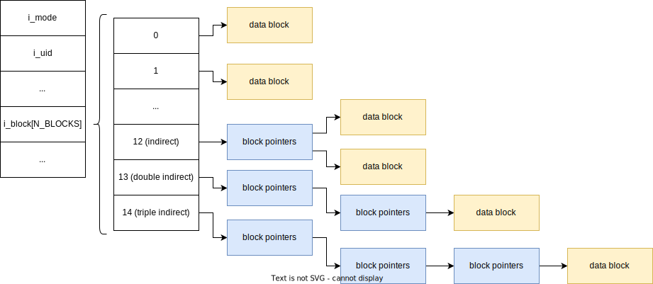

<style>
img[alt~="center"] {
  display: block;
  margin: 0 auto;
}
.columns {
  display: grid;
  grid-template-columns: repeat(2, minmax(0, 1fr));
  gap: 0.5rem;
}
</style>

# Файлы

---

# Что такое файл?

---

# Что такое файл?
Файл – это сущность, которая содержит данные, имеет имя и ассоциированные с ним метаданные

---

# Имя файла
* Не более `PATH_MAX` (включая `\0`) символов: 4 Кб на современных ОС, 256 байт для переносимости
* Разделитель пути – `/`, части пути не более 255 символов каждая
* Самоё короткое имя файла – `/` – самая верхнеуровневая директория (корневая)
* Абсолютный путь: начинается с корня (например, `/Users/carzil/mipt`)
* Относительный путь: вычисляется от текущей директории (например, `carzil/mipt`)
* `.` – текущая директория (`./carzil/mipt` = `carzil/mipt` и `./carzil/./././mipt` = `./carzil/mipt`)
* `..` – директория выше (`/Users/carzil/mipt/..` = `/Users/carzil`)

---

# Everything is a file
* Регулярные файлы
* Директории
* Символические ссылки
* FIFO (именованные каналы)
* Сокеты

---

# Файловая система
* On-disk структура данных для организации хранения файлов
* Работают поверх хранилища (HDD, SSD, NVMe)
* Хранилище традиционно разбивается на *блоки*, в которых хранятся либо данные, либо специальные структуры
* Размер блоков обычно 512 байт или 4 Кб
* Файлы занимают блоки с данными

---

# Как объединить несколько файловых систем в одной ОС?
* Windows-way: `C:`, `D:`, `A:`, etc
* UNIX-way: единое пространство имён
* Все файлы, все директории всех файловых систем – это всё-всё-всё хранится в **едином пространстве**
* VFS = Virtual file system

---

# Работа с данными файла

```c
#include <unistd.h>

int open(const char *pathname, int flags, mode_t mode);
ssize_t read(int fd, void *buf, size_t count);
ssize_t write(int fd, const void *buf, size_t count);
int close(int fd);
```

---

# Позиция внутри файла
<div class="columns">
<div>

* С каждым _файловым дескриптором_ связана текущая позиция в файле
* read/write последовательно увеличивают эту позицию
* `lseek` позволяет перемещать текущую позицию
* `off_t = int32_t` на 32-битных системах!

</div>
<div>

```c

#define SEEK_SET ...
#define SEEK_CUR ...
#define SEEK_END ...

off_t lseek(int fd, off_t offset, int whence);
off64_t lseek64(int fd, off64_t offset, int whence);
```

</div>
</div>

---

# Работа с метаданными файла
<div class="columns">
<div>

* Получить метаинформацию о файле можно с помощью семейста сисколлов `*stat`
* Все они возвращают специальную структуру `struct stat`
* `lstat` не следует по символическим ссылкам

</div>
<div>

```c
#include <sys/stat.h>

int stat(const char* path, struct stat* buf);
int fstat(int fd, struct stat *stat);
int lstat(const char* path, struct stat* stat);

struct stat {
    dev_t     st_dev;
    ino_t     st_ino;
    mode_t    st_mode;
    nlink_t   st_nlink;
    uid_t     st_uid;
    gid_t     st_gid;
    dev_t     st_rdev;
    off_t     st_size;
    blksize_t st_blksize;
    blkcnt_t  st_blocks;
    struct timespec st_atime/st_mtime/st_ctime;
};
```

</div>
</div>

---

# Права доступа
<div class="columns">
<div>

* rwx = **R**ead/**W**rite/e**X**ecute
* 9 бит, 3 группы
* Права владельца, права группы и права для остальных
* Часто записываются как числа в восьмиричной системе счисления
* $777_8 = 111111111_2$ = `rwxrwxrwx`
* $644_8 = 110100100_2$ = `rw-r--r--`
* `st_uid`/`st_gid` содержит ID владельца/группы-владельца

</div>
<div>

```c
struct stat {
    // ...
    mode_t    st_mode;
    uid_t     st_uid;
    gid_t     st_gid;
    // ...
};
```

</div>

---

# Права доступа для директорий
* r – листинг директории
* w – создание файлов внутри директории
* x – возможность перейти в директорию (cd), а также доступ к файлам

---

# Регулярные файлы
<div class="columns">
<div>

* `S_ISREG(stat.st_mode)`
* Обычные файлы с данными
* Данные хранятся в блоках одинакового размера
* `st_size` содержит точное количество байт внутри файла
* `st_blocks` – количество блоков файла (под блоком подразумевается 512 байтовый блок)
* `st_blksize` – предпочитаемый размер блока для операций
* `st_atime/st_mtime` – последний доступ/модификация

</div>
<div>

```c
struct stat {
    // ...
    mode_t    st_mode;
    off_t     st_size;
    blksize_t st_blksize;
    blkcnt_t  st_blocks;
    struct timespec st_atime/st_mtime;
    // ...
};
```

</div>

---

# Регулярные файлы
Что из этого может быть верно?
* `st_size < st_blocks * 512`
* `st_size == st_blocks * 512`
* `st_size > st_blocks * 512`

---

# Регулярные файлы
* `st_size < st_blocks * 512`: размер файла не кратен размеру блока
* `st_size == st_blocks * 512`: размер файла кратен размеру блока
* `st_size > st_blocks * 512`: в файле есть «дырки» – виртуальные блоки заполненные нулями

---

# Как создать «дырки» в файлах?
<div class="columns">
<div>

* `lseek` + `write`
* `truncate` позволяет только добавлять/удалять байты с конца
* `fallocate` умеет: добавлять произвольное количество нулевых байт в произвольное место, вырезать произвольный диапазон, обнулять произвольный диапазон
* Меняют стуктуры данных на диске, но не сами данные!
* `This is a nonportable, Linux-specific system call.` 🙁

</div>
<div>

```c
int fallocate(int fd, int mode, off_t offset, off_t len);
int truncate(const char *path, off_t length);
int ftruncate(int fd, off_t length);
```


</div>
</div>

---

# inode
* У файла может быть много имён, но физически при этом он будет храниться в одной копии
* inode – это _сама сущность файла_, имена файла – «указатели» на неё
* У каждой inode есть собственный ID
* Количество inode огранично внутри одной файловой системы

---

# Директории
<div class="columns">
<div>

* `S_ISDIR(stat.st_mode)`
* Директория представляет собой список _directory entry_ или _dirent_
* Каждая dirent хранит имя файла и inode, на который она указывает
* Специальный API для чтения: обычные `read`/`write` не работают
* Размер `struct dirent` неопределён!

</div>
<div>

```c
struct dirent {
    ino_t          d_ino;
    unsigned short d_reclen;
    unsigned char  d_type;
    char           d_name[];
    // ...
};


DIR* opendir(const char* name);
struct dirent* readdir(DIR* dirp);
void rewinddir(DIR *dirp);
int closedir(DIR *dirp);

int mkdir(const char *pathname, mode_t mode);
int rmdir(const char *pathname);
```

</div>

---

```
$ ls -lah public-basic-2023
total 24
24290740 drwxr-xr-x   9 carzil  staff   288 Sep 11 18:08 .
 3349887 drwxr-xr-x  18 carzil  staff   576 Sep 11 18:12 ..
24290745 drwxr-xr-x  15 carzil  staff   480 Sep 11 18:09 .git
24301574 -rw-r--r--   1 carzil  staff   765 Sep 11 18:08 .gitlab-ci.yml
24301575 drwxr-xr-x   3 carzil  staff    96 Sep 11 18:08 00-intro
24301588 drwxr-xr-x   4 carzil  staff   128 Sep 11 18:08 01-data-representation
24301615 -rw-r--r--   1 carzil  staff  2704 Sep 11 18:08 GUIDE.md
24301616 -rw-r--r--   1 carzil  staff   320 Sep 11 18:08 README.md
24301617 -rw-r--r--   1 carzil  staff     0 Sep 11 18:08 requirements.txt
```

---

# Жёсткие ссылки

<div class="columns">
<div>

* Аналог `std::shared_ptr` для inode
* Существуют только внутри одной файловой системы
* Если количество жёстких ссылок стало равно 0, то inode удаляется
* `stat.st_nlink` хранит количество жёстких ссылок на файл
* Не отдельный файл, а _сущность файловой системы_
* Удаление – `unlink`, перемещение – `rename`

</div>
<div>

```c
struct stat {
    // ...
    nlink_t   st_nlink;
    // ...
};

int link(const char *old, const char *new);
int unlink(const char *name);
int rename(const char *old, const char *new);
```

</div>
</div>

---

# Символические ссылки

* `S_ISLNK(stat.st_mode)`
* Отдельный тип файла
* Аналог `std::weak_ptr` для inode
* Dangling symlinks: ссылаются на файл, которого нет

```c
ssize_t readlink(const char* path, char* buf, size_t sz);
int symlink(const char* target, const char* linkpath);
```

---



---

# **Everything** is a file!
* Даже клавиатуры, звуковые карты, последовательные порты, флешки, сетевые карты, диски, видео карты etc
* Все устройства представлены в специальной _псевдо-файловой системе_
* Файлы устройств создаются драйверами внутри ОС
* Символьные и блочные

---

# Символьные устройства (character device)
* `S_ISCHR(stat.st_mode)`
* Устройства, из которых можно последовательно читать
* Звуковая карта, последовательные порты (COM), сетевые карты, etc

# Блочные устройства (block device)
* `S_ISBLK(stat.st_mode)`
* Разбиты на блоки одинакового размера
* Можно прочитать любой блок
* HDD, SSD, NAS, Floppy, etc

---

# Монтирование файловой системы
* Монтирование файловой системы – добавление файловой структуры файловой системы в единую файловую систему (VFS)
* `mount` – системный вызов для монтирования
* `source` – это (обычно) блочное устройство диска (или раздела)
* `target` – это куда нужно примонитировать


```c
int mount(
    const char* source, const char* target,
    const char* filesystemtype, unsigned long mountflags,
    const void* data
);
int umount(const char *target);
```

---

# ext2
* Linux, 1993 год
* Диск разбивается на блоки заданного размера (этот размер блока может быть больше, чем физический размер блока устройства)
* Блоки около начала задают _таблицу inode_ и битовый массив занятых блоков на диск
* Остальные блоки хранят данные
* inode #2 соответствует корневой директории
* Директории представлены в виде простого списка dirent


---



---

# Проблемы ext2
* Изменение inode требует нескольких записей на диск, которые могут сломаться
* Поиск файла в больших директориях занимает линейное время
* Даже если блоки хранятся последовательно на диске, всё равно нужно выделять под него запись

---

# ext4
* 2006 год
* Де-факто стандартная файловая система для Linux
* _Журналируемая_
* Для больших директорий используется HTree
* extents – «регионы диска»
* Продвинутые алгоритмы аллокации блоков

---

# sysfs и procfs
* «Метафайловые системы»
* Не имеют никаких данных на диске, возвращают информацию напрямую из ядра Linux
* Часто используются, чтобы не добавлять новые сисколлы

---

# procfs
* `/proc/<pid>/status` – содержит информацию о процессе
* `/proc/<pid>/fd/N` – директория, которая содержит символические ссылки на файлы за открытыми файловыми дескрипторами
* `/proc/<pid>/exe` – символическая ссылка на исполняемый файл
* `/proc/<pid>/cwd` – символическая ссылка на рабочую директорию процесса
* `/proc/<pid>/environ` – список environment переменных процесса
* `/proc/<pid>/cmdline` – список аргументов процесса

---

```
$ cat /proc/self/status
Name:	cat
Umask:	0022
State:	R (running)
Pid:	1466
Uid:	0	0	0	0
Gid:	0	0	0	0
FDSize:	256
Groups:	0
VmPeak:	    2344 kB
VmSize:	    2344 kB
VmLck:	       0 kB
VmPin:	       0 kB
VmHWM:	     784 kB
VmRSS:	     784 kB
RssAnon:	      76 kB
RssFile:	     708 kB
RssShmem:	       0 kB
SigPnd:	0000000000000000
SigBlk:	0000000000000000
SigIgn:	0000000000000000
CapInh:	0000000000000000
CapPrm:	00000000a80425fb
CapEff:	00000000a80425fb
CapBnd:	00000000a80425fb
CapAmb:	0000000000000000
Cpus_allowed:	ff
Cpus_allowed_list:	0-7
Mems_allowed:	1
Mems_allowed_list:	0
...
```

---

# FUSE
* Код файловой системы обычно расположен в ядре – это неудобно
* FUSE = file system in userspace
* Все операции с файловой системой проксируются в пользовательский процесс
* Как? Через специальное устройство, конечно! `/dev/fuse`

---

# ありがとう!
